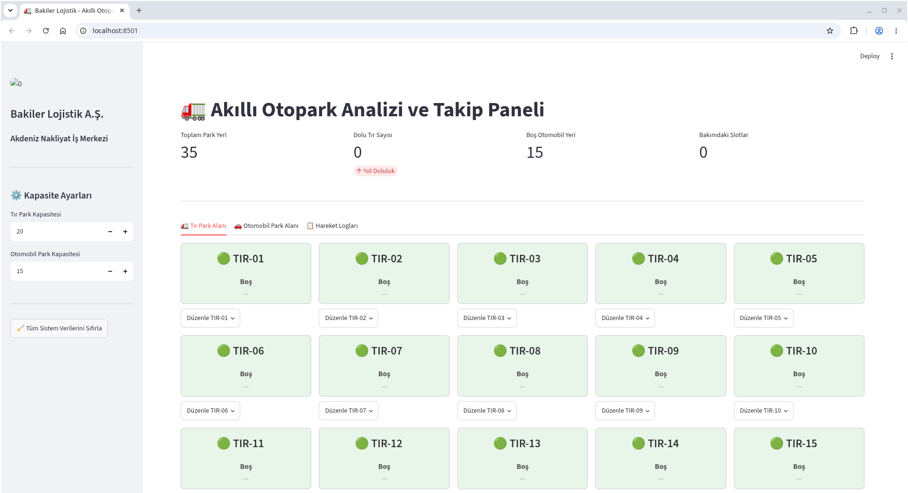

Sahadaki tır ve binek şirket araçlarının giriş-çıkışlarında yaşanan park yeri belirsizliğini gidermek için tasarlanan bu yazılım, **Python** ve **Streamlit** kütüphanesi kullanılarak geliştirilmiştir.

### ✨ Öne Çıkan Özellikler

* **Dinamik Kapasite Yönetimi:** Tır ve Otomobil park kapasitelerinin kenar çubuğu (Sidebar) üzerinden anlık olarak ayarlanabilmesi.
* **Görsel Dashboard ve Renk Kodlaması:**
  * 🟢 **Boş Slotlar:** Yeşil
  * 🔴 **Dolu Slotlar:** Kırmızı
  * 🟡 **Bakımda / Rezerve Slotlar:** Sarı
* **Real-Time Metrik Paneli:** Toplam park alanı, dolu tır sayısı, boş otomobil kapasitesi ve bakımdaki slotların anlık gösterimi.
* **🚨 Otomatik Alarm Mekanizması:** Tır park alanı tam doluluğa ulaştığında güvenlik personeline görsel uyarı ekranı.
* **JSON Veri Senkronizasyonu:** `st.session_state` mimarisi ve JSON veritabanı ile verilerin anında yerel ortama kaydedilmesi.
* **📊 Hareket ve Denetim Logları:** Araç giriş-çıkış ve durum güncellemelerinin zaman damgalı olarak CSV dosyasında saklanması.
* **Çoklu Cihaz ve Yerel Ağ Desteği:** Güvenlik kulübesi ve operasyon merkezinden eş zamanlı erişim (1 saniyenin altında tepki süresi).

---

## 📁 Proje Dosya Yapısı

smart_park/
│
├── app.py                # Streamlit ana uygulama ve arayüz kodu
├── otopark_verisi.json   # Anlık slot durumlarının saklandığı JSON veritabanı
├── otopark_loglari.csv   # Araç hareket ve işlem geçmişi log dosyası
├── requirements.txt      # Gerekli Python paketleri listesi
└── README.md             # Proje dokümantasyonu

🚀 Linux Ortamında Kurulum ve Çalıştırma

Aşağıdaki adımları Linux terminalinizde sırasıyla çalıştırarak projeyi kurabilir ve yayına alabilirsiniz:
1. Proje Dizinini Oluşturma ve Hazırlık
Bash

# Proje klasörünü oluşturun ve içine girin
mkdir -p smart_park && cd smart_park

2. Python Sanal Ortamını (venv) Kurma
Bash

### Sanal ortamı oluşturun
python3 -m venv venv

### Sanal ortamı aktif edin
source venv/bin/activate

## 3. Bağımlılıkların Yüklenmesi

requirements.txt dosyasını oluşturun veya doğrudan yükleyin:
Bash

pip install --upgrade pip
pip install streamlit pandas

### 📡 Canlı Ortamda (Yerel Ağda) Yayına Alma

Uygulamanın güvenlik kulübesi ve Toroslar lojistik yönetim birimindeki diğer bilgisayar/tabletlerden erişilebilir olması için IP dinleme modunda başlatılması gerekir:
Bash

streamlit run app.py --server.port 8501 --server.address 0.0.0.0

### 🌐 Erişim Adresleri

- Yerel Sunucu (Local): http://localhost:8501
- Yerel Ağ (LAN Access): http://<LINUX_SUNUCU_IP_ADRESI>:8501

İpucu: Sunucunuzun IP adresini öğrenmek için Linux terminalinde hostname -I veya ip a komutunu kullanabilirsiniz.

Kapasite Ayarlama: Sol taraftaki menüden (Sidebar) güncel Tır ve Otomobil kapasitesini belirleyin.

### Durum Güncelleme:

- İlgili parka ait slot kartının altındaki "Düzenle" butonuna tıklayın.
- Durumu (Boş, Dolu, Bakımda/Rezerve) seçin.
- Araç Dolu ise plaka bilgisini girin ve "Kaydet ve Senkronize Et" butonuna basın.
- Log Takibi: "📋 Hareket Logları" sekmesinden geçmişe dönük tüm araç giriş-çıkış ve durum güncellemelerini inceleyebilirsiniz.
- Sistemi Sıfırlama: Sol menüdeki "Tüm Sistem Verilerini Sıfırla" butonu ile tüm slotları tek tıkla varsayılan "Boş" durumuna getirebilirsiniz.

### 🛠️ Teknik Özellikler ve Mimari

Arayüz Framework: Streamlit
Veri İşleme & Loglama: Pandas
Veri Depolama Formatı: JSON (Aktif Durum) & CSV (Tarihçe Logları)
Tepki Süresi: < 1000ms (Ağ içi senkronizasyon)
